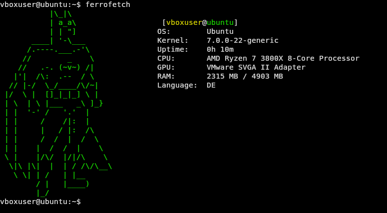

# ferrofetch
Neofetch alternative written in Rust.


Why ferroretch?
Ferro means iron on latin and iron get's Rusty and the project is written in Rust ;)

---

## Features

- System user and hostname
- OS name
- Kernel
- System uptime
- CPU name
- GPU name
- RAM (used/total)
- System language
- ASCII banners
- Adjustable color and different banners with cli arguments

---

## Screenshot


---

## Installation
1. clone the repo
```bash
git clone https://github.com/Kiwilus/ferrofetch.git
```
2. change into the project directory
```bash
cd ferrofetch
```
3. and install the tool
```bash
cargo install --path .
```
4. then execute with:
```bash
ferrofetch
```
## Quick start

### when you execute ```ferrofetch``` by default it will give you the batman banner and green color.

### you can set the color and the banner when executing ```ferrofetch --banner your_banner_of_choice --color your_color_of_choice```

---

## Available banners and colors
- ### Available banners:
- batman(default):
```
          .  .
          |\_|\
          | a_a\
          | | "]
      ____| '-\___
     /.----.___.-'\
    //        _    \
   //   .-. (~v~) /|
  |'|  /\:  .--  / \
 // |-/  \_/____/\/~|
|/  \ |  []_|_|_] \ |
| \  | \ |___   _\ ]_}
| |  '-' /   '.'  |
| |     /    /|:  | 
| |     |   / |:  /\
| |     /  /  |  /  \
| |    |  /  /  |    \
\ |    |/\/  |/|/\    \
 \|\ |\|  |  | / /\/\__\
  \ \| | /   | |__
       / |   |____)
       |_/

```
- dog:
```
       / \\__
      (    @\\___
      /         O
     /   (_____/
    /_____/   U
```


- ### Available colors
- red
- green
- yellow
- blue
- magenta
- cyan
- white
- black


---

## Roadmap

### Planned features

- configuration in a .config/rustop/rustop.conf file where you can set color/banner manually and forever
- this structure: user@hostname, OS, Kernel, Uptime, CPU name, GPU, RAM (used/total), Disk usage, local IP adress

### Done things

- Argument parsing with clap and other ASCII banners
- Argument parsing with clap for the color of the banner
